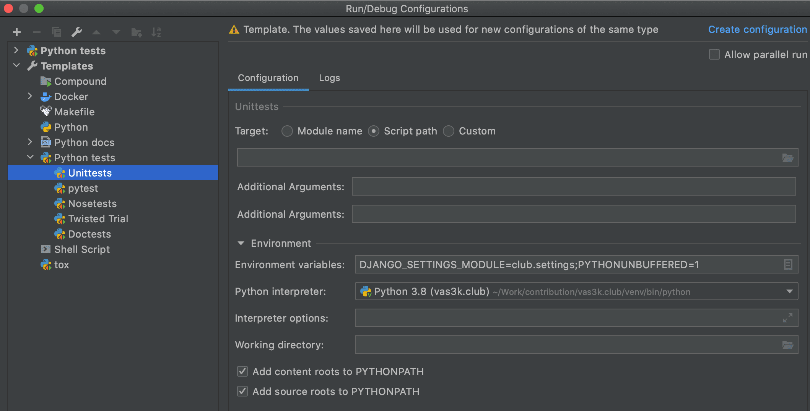

<div align="center">
  <br>
  
  <h1>vas3k.club</h1>
</div>

Welcome to the [vas3k.club](https://vas3k.club) codebase. Here we are building our small lifestyle IT community. If you want to help us with that, welcome.

[vas3k.club](https://vas3k.club) is a platform with private and paid memberships that has emerged around the [vas3k.ru](https://vas3k.ru) blog and satellite chat rooms. It's not a typical IT community with tutorials and framework reviews, but rather more of a lifestyle one. We are trying to build a peaceful and useful ecosystem, which the Internet has lost a long ago. Therefore, we carefully select and filter new members and do not seek wild growth.

Our values: honesty, fair share, respect for other members, rationality, friendliness and usefulness. We have a zero-tolerance policy on anonymity, insults and toxicity. But we always try to stay in touch with reality, so we're also not tolerant of witch hunting and call-out culture.

We're bullshitless community!

## 🔮 Installing and running locally

1. Install [Docker](https://www.docker.com/get-started)

2. Clone the repo

    ```sh
    $ git clone https://github.com/vas3k/vas3k.club.git
    $ cd vas3k.club
    ```

3. Run

    ```sh
    $ docker-compose up
    ```

It will start the development server with all the necessary services. Wait till it starts and go to [http://127.0.0.1:8000/](http://127.0.0.1:8000/). Voila.

At the very beginning, you probably need a dev account to log in. Open [http://127.0.0.1:8000/godmode/dev_login/](http://127.0.0.1:8000/godmode/dev_login/) in your browser and it will create one for you and log you in.
- To create new test user: open [http://127.0.0.1:8000/godmode/random_login/](http://127.0.0.1:8000/godmode/random_login/)

Auto-reloading for backend and frontend is performed automatically on every code change. If everything is broken and not working (it happens), you can always rebuild the world from scratch using `docker-compose up --build`.

### Advanced setup:

#### Telegram bot
To run telegram bot you have to:
  1. Copy env.exmaple file: `cp ./club/.env.example ./club/.env`
  2. Fill all the requirement fields in `./club/env`, such as `TELEGRAM_TOKEN` etc.
      - `TELEGRAM_TOKEN` you can get from [@BotFather](https://t.me/BotFather)
      - To get `TELEGRAM_CLUB_CHANNEL_URL`, `TELEGRAM_ADMIN_CHAT_ID` etc Just Simply Forward a message from your group/channel to [@JsonDumpBot](https://t.me/JsonDumpBot) or [@getidsbot](https://t.me/getidsbot)
  3. Rebuild application: `docker-compose up --build`

#### Docker-compose
Check out our [docker-compose.yml](https://github.com/vas3k/vas3k.club/blob/master/docker-compose.yml) to understand the infrastructure.

#### Local development
Once you decided to code something in the project you'll need to setup your environment. Here's how you can make it.

##### Setup venv
Through `pipenv` // todo: (у меня с ним было 2 проблемы)
 - сходу не получилось выпилить установку gdal либы (удаление из pipfile и pipfile.locka не помогло), чтобы оно не фейлило установку остальных пакетов
 - не получилось указать папку созданного из консоли pipenv'а в pycharm'е

Through old fashion `virtualenv`:
 - setup your Python Interpreter at PyCharm with `virtualenv`
 - install deps from [requirements.txt](requirements.txt) and [dev_requirements.txt](dev_requirements.txt)
  ```sh
  (venv) $ pip install --upgrade -r requirements.txt  
  (venv) $ pip install --upgrade -r requirements.dev.txt  
  ```

If you don't need to work with Geo Data and installation of `gdal` package is failed so skip it with next workaround:
```sh
# run each line of reqs independently
(venv) $ cat requirements.txt | xargs -n 1 pip install
```

##### Setup postgres
###### locally
  Easies way is to run postgres is to run in docker, just run it with follow command:
  ```sh
  $ docker-compose -f docker-compose.yml up -d postgres
  ```
  When you need to connect to postgres use next params:
  ```dotenv
  POSTGRES_DB=vas3k_club
  POSTGRES_USER=postgres
  POSTGRES_PASSWORD=postgres
  POSTGRES_HOST=localhost
  ```

  <details><summary>In case you really want setup local postgres then go under cut...</summary>

    Brief instruction:
  
    1. Install postgresql (for macos https://postgresapp.com/ is easies start)
    2. After you install and run postgress create a project database:
          ```sh
          # create db
          $ psql postgres
          postgres=# createdb vas3k_club

          # create user (user: vas3k, password: vas3k)
          postgres=# createuser --interactive --pwpromp

          # grant priviliges
          postgres=# GRANT ALL PRIVILEGES ON DATABASE vas3k_club TO vas3k;
          postgres=# \connect vas3k_club
          postgres=# GRANT ALL PRIVILEGES ON ALL TABLES IN SCHEMA public TO vas3k;
          postgres=# GRANT ALL PRIVILEGES ON ALL SEQUENCES IN SCHEMA public to vas3k;
          postgres=# GRANT ALL PRIVILEGES ON ALL FUNCTIONS IN SCHEMA public to vas3k;
          postgres=# \q

          # check connection
          $ psql -d vas3k_club -U vas3k
          ```

  </details>
  
##### Setup frontend
```sh
$ cd frontend
$ npm run watch # will implicitly run `npm ci`
```

##### Run dev server
After you have setup postgres, venv and build frontend (look this steps above) complete preparations with follow commands:
```sh
# run redis
$ docker-compose -f docker-compose.yml up redis

# run queue
(venv) $ ./manage.py qcluster

# run db migration
(venv) $ ./manage.py migrate

# run dev server
(venv) $ ./manage.py runserver 0.0.0.0:8000
```


#### Tests

##### Prerequisites
Consider next required conditions for running tests :
- **venv**

  Don't forget to run it under configured venv. Look [setup venv](#setup-venv) how to configure venv
- **postgres**

  Due to tests make database queries the local postgres should be running. 
  
  Run postgres:
  ```sh
  $ docker-compose -f docker-compose.yml up -d postgres
  ```
  For first time run migrations (it needs only for fresh images) 
  ```sh 
  (venv) $ ./manage.py migrate
  ```
- **redis**
  Run redis:
  ```sh
  $ docker-compose -f docker-compose.yml up -d redis
  ```
- build **frontend**
  
  For [views tests](https://docs.djangoproject.com/en/3.1/intro/tutorial05/#a-test-for-a-view) its essential to build our frontend upfront. 
  Hot to build front look [setup-frontend](#setup-frontend) section, for now just run next commands:
  ```sh
  $ cd frontend
  $ npm ci # or npm install
  $ npm run build
  ```
  Above commands will create [required `webpack-stats.json`](https://github.com/vas3k/vas3k.club/blob/6f1812f36b546feba2bd729ac84011e20e237136/club/settings.py#L228) file
- test environment variables
  ```dotenv
  DJANGO_SETTINGS_MODULE=club.settings;
  PYTHONUNBUFFERED=1;
  TESTS_RUN=da
  POSTGRES_DB=vas3k_club
  POSTGRES_USER=postgres
  POSTGRES_PASSWORD=postgres
  POSTGRES_HOST=localhost
  REDIS_DB=0
  REDIS_HOST=localhost
  ```
##### Run tests
Basically tests automatically runs in CI in opened PR, but if you want to run tests **locally** there are few ways to do it
1. virgin shell
   ```sh
   $ make test
   ```
2. venv shell
   ```sh
   $ source {your-venv-folder}/bin/activate
   (venv) $ ./manage.py test
   ```
   (^*don't forget inject test env variables*)
3. pycharm *profession edition*
   Use `django tests` template out of the box
4. pycharm *common edition*
   - Make sure you have set `Unittest` as default test runner: Settings --> Tools --> Python Integrated Tools --> Default Test Runner: Unittests
   
   - In Run/Debug Configuration put environment variables from [prerequisites](#Prerequisites)
     
   - For workaround *"django.core.exceptions.AppRegistryNotReady: Apps aren't loaded yet."* add this lines to test file before importing models:
     ```python
     import django
     django.setup()
     ```

For more information about testing in django look well written [official documentation](https://docs.djangoproject.com/en/3.1/topics/testing/overview/)

## 🛠 Tech stack

👨‍💻 **TL;DR: Django, Postgres, Redis, Vue.js, Webpack**

We try to keep our stack as simple and stupid as possible. Because we're not very smart either.

> This section is in progress...

## 🚢 Deployment

CI/CD has setuped via github-actions. Go further to the [.github](.github/) folder to see details.

:point_up: We still need someone who will improve and optimize ci workflows


## 😍 Contributions

Contributions are welcome.  

The main point of interaction is the [Issues](https://github.com/vas3k/vas3k.club/issues).

We also run the public [Trello Board](https://trello.com/b/SAbS5JiI/) to track progress and develop roadmaps.

> The official development language at the moment is Russian, because 100% of our users speak it. We don't want to introduce unnecessary barriers for them. But we are used to writing commits and comments in English and we won't mind communicating with you in it.

### 🐛 How to report a bug or propose a feature?

Open [a new issue](https://github.com/vas3k/vas3k.club/issues/new). Explain your idea or proposal in all the details. Attach a screenshot or wireframe.

If it's a bug, make sure you clearly describe "observed" and "expected" behaviour. It will dramatically save time for our contributors and maintainers.

When ticket receives a label it is automatically added to our board in Trello to track further progress.

### 😎 I want to write some code!

Open our [Trello](https://trello.com/b/SAbS5JiI/) to see the most important tickets at top. Then go to [Issues](https://github.com/vas3k/vas3k.club/issues) and pick one you like. Don't forget to leave a comment inside that you're getting it. Our maintainers track them and update the board. 

For small fixes just open a PR. For big changes open an issues first or (if it's already opened) leave a comment with brief explanation what and why you're going to change. Many tickets hang open not because they cannot be done, but because they cause many logical contradictions that you may not know. It's better to clarify them in comments before sending a PR.

Pay attention to issue labels placed on tickets by our maintainers.

- **no label** — ticket is new or controversial. Feel free to discuss it but wait for our maintainers' decision before starting to implement it.
- **idea** — discussion is needed. Those tickets look adequate, but waiting for real proposals how they will be done. Don't implement them right away.
- **good first issue** — good tickets for first-timers. Usually these are simple and not critical things that allow you to quickly feel the code and start contributing to it.
- **bug** — the first priority, obviously.
- **improvement** — accepted improvements for an existing module. Like adding a sort parameter to the feed. If improvement requires UI, be sure to provide a sketch before you start.
- **new feature** —  completely new features. Usually they're too hard for newbies, leave them for experienced contributors. 
 
## 👍 Our top contributors

I would like to press F and give some respects to our [best contributors](https://github.com/vas3k/vas3k.club/graphs/contributors), who spent their own time to make the club better.

- [@vas3k](https://github.com/vas3k)
- [@nikolay-govorov](https://github.com/nikolay-govorov)
- [@FMajesty](https://github.com/FMajesty)


## 👩‍💼 License 

[MIT](LICENSE)

In other words, you can use the code for private and commercial purposes with an author attribution (by including the original license file or mentioning the Club 🎩).

Feel free to contact us via email [club@vas3k.club](mailto:club@vas3k.club).

❤️
