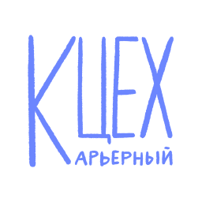

<div align="center">
  <br>
  
  <h1>vas3k.club</h1>
</div>

This is my fork!

Welcome to the [vas3k.club](https://vas3k.club) codebase. We're building our own little IT-lifestyle community. We've opensourced the code so that every member could contribute or implement a feature that they want.

[vas3k.club](https://vas3k.club) is a platform with private and paid memberships that has emerged around the [vas3k.ru](https://vas3k.ru) blog and satellite chat rooms. It's not a typical IT community with tutorials and framework reviews, but rather more of a lifestyle one. We are trying to build a peaceful and useful ecosystem, which the Internet has lost a long ago. Therefore, we carefully select and filter new members and do not seek wild growth.

Our values: honesty, fair share, respect for other members, rationality, friendliness and usefulness. We have a zero-tolerance policy on anonymity, insults and toxicity. But we always try to stay in touch with reality, so we're also not tolerant of witch hunting and call-out culture.

We're a bullshitless community!

## 🛠 Tech stack

👨‍💻 **TL;DR: Django, Postgres, Redis, Vue.js, Webpack**

We try to keep our stack as simple and stupid as possible. Because we're not very smart either.

The trickiest part of our stack is how we develop the frontend and backend as a single service. We don't use SPA, as many people do, but only make parts of the page dynamic by inserting Vue.js components directly into Django templates. This may seem weird, but it actually makes it very easy for one person to develop and maintain the entire site.

You don't really need to understand how the magic of webpack <-> django communication works under the hood to develop new components. Just run `django runserver` and `npm run watch` at the same time and enjoy your coding.

Feel free to propose "state of the art" refactorings for UI or backend code if you know how to do it better. We're open for best practices from both worlds.

## 🔮 Installing and running locally

1. Install [Docker](https://www.docker.com/get-started)

2. Clone the repo

    ```sh
    $ git clone https://github.com/vas3k/vas3k.club.git
    $ cd vas3k.club
    ```

3. Run

    ```sh
    $ docker-compose up
    ```

This will start the application in development mode on [http://127.0.0.1:8000/](http://127.0.0.1:8000/), as well as other necessary services: postgres database, queue with workers, redis and webpack. 

The first time you start it up, you'll probably need a test account to get right in. Go to [/godmode/dev_login/](http://127.0.0.1:8000/godmode/dev_login/) and it will create an admin account for you (and log you in automatically). To create new test user hit the [/godmode/random_login/](http://127.0.0.1:8000/godmode/random_login/) endpoint.

Auto-reloading for backend and frontend is performed automatically on every code change. If everything is broken and not working (it happens), you can always rebuild the world from scratch using `docker-compose up --build`.

## 🧑‍💻 Advanced setup for devs

For more information on how to test the telegram bot, run project without docker and other useful notes, read [docs/setup.md](docs/setup.md).

## ☄️ Testing

We use standard Django testing framework. No magic, really. You can run them from PyCharm or using Django CLI. 

See [docs/test.md](docs/test.md) for more insights.

> We don't have UI tests, sorry. Maybe in the future

## 🚢 Deployment

No k8s, no AWS, we ship dockers directly via ssh and it's beautiful!

The entire production configuration is described in the [docker-compose.production.yml](docker-compose.production.yml) file. 

Then, [Github Actions](.github/workflows/deploy.yml) have to take all the dirty work. They build, test and deploy changes to production on every merge to master (only official maintainers can do it).

Explore the whole [.github](.github) folder for more insights.

We're open for proposals on how to improve our deployments without overcomplicating it with modern devops bullshit.

## 🛤 Forking and tweaking

Forks are welcome. We're small and our engine is not universal like Wordpress, but with sufficient programming skills (and using grep), you can launch your own Club website in a couple of weeks. 

Three huge requests for everyone:

- Please give kudos the original authors. "Works on vas3k.club engine" in the footer of your site will be enough.
- Please share new features you implement with us, so other folks can also benefit from them, and your own codebase minimally diverges from the original one (so you can sync updates and security fixes) . Use our [feature-flags](club/features.py).
- Do not use our issues and other official channels as a support desk. Use [chats](https://t.me/joinchat/T5DDOpAVcZwzODg0).

> ♥️ [Feature-flags](club/features.py) are great. Use them to tweak your fork. Create new flags to upstream your new features or disable existing ones.

## 🙋‍♂️ How to report a bug?

- 🆕Open [a new issue](https://github.com/vas3k/vas3k.club/issues/new). 
- 🔦 Please, **use a search**, to check, if there is already existed issue!
- Explain your idea or proposal in all the details: 
    - Make sure you clearly describe "observed" and "expected" behaviour. It will dramatically save time for our contributors and maintainers. 
    - **For minor fixes** please just open a PR.
    
## 💎 Now to propose a new feature?

- Go to our [Discussions](https://github.com/vas3k/vas3k.club/discussions)
- Check to see if someone else has already come up with the idea before
- Create a new discussion
- 🖼 If it's **UI/UX** related: attach a screenshot or wireframe

## 😍 Contributions

Contributions are welcome.  

The main point of interaction is the [Issues page](https://github.com/vas3k/vas3k.club/issues).

Here's our contribution guidelines — [CONTRIBUTING.md](CONTRIBUTING.md).

We also run the public [Github Project Board](https://github.com/vas3k/vas3k.club/projects/3) to track progress and develop roadmaps.

> The official development language at the moment is Russian, because 100% of our users speak it. We don't want to introduce unnecessary barriers for them. But we are used to writing commits and comments in English and we won't mind communicating with you in it.

### 😎 I want to write some code

- Open our [Issues page](https://github.com/vas3k/vas3k.club/issues) to see the most important tickets at top. 
- Pick one issue you like and **leave a comment** inside that you're getting it.

**For big changes** open an issues first or (if it's already opened) leave a comment with brief explanation what and why you're going to change. Many tickets hang open not because they cannot be done, but because they cause many logical contradictions that you may not know. It's better to clarify them in comments before sending a PR.

### 🚦Pay attention to issue labels!

#### 🟩 Ready to implement

- **good first issue** — good tickets **for first-timers**. Usually these are simple and not critical things that allow you to quickly feel the code and start contributing to it.
- **bug** — if **something is not working**, it needs to be fixed, obviously.
- **critical** — the **first priority** tickets.
- **improvement** — accepted improvements for an existing module. Like adding a sort parameter to the feed. If improvement requires UI, **be sure to provide a sketch before you start.**

#### 🟨 Discussion is needed

- **new feature** —  completely new features. Usually they're too hard for newbies, leave them **for experienced contributors.**
- **idea** — **discussion is needed**. Those tickets look adequate, but waiting for real proposals how they will be done. Don't implement them right away.

#### 🟥 Questionable

- [¯\\_(ツ)\_/¯](https://github.com/vas3k/vas3k.club/labels/%C2%AF%5C_%28%E3%83%84%29_%2F%C2%AF) - special label for **questionable issues**. (should be closed in 60 days of inactivity)
- **[no label]** — ticket is new, unclear or still not reviewed. Feel free to comment it but **wait for our maintainers' decision** before starting to implement it.


## 🔐 Security and vulnerabilities

If you think you've found a critical vulnerability that should not be exposed to the public yet, you can always email me directly on Telegram [@vas3k](https://t.me/vas3k) or by email: [me@vas3k.ru](mailto:me@vas3k.ru).

Please do not test vulnerabilities in public. If you start spamming the website with "test-test-test" posts or comments, our moderators will ban you even if you had good intentions.


## 👍 Our top contributors

Take some time to press F and give some respects to our [best contributors](https://github.com/vas3k/vas3k.club/graphs/contributors), who spent their own time to make the club better.

- [@vas3k](https://github.com/vas3k)
- [@dimabory](https://github.com/dimabory)
- [@devcooch](https://github.com/devcooch)
- [@nlopin](https://github.com/nlopin)
- [@fr33mang](https://github.com/fr33mang)
- [@Vostenzuk](https://github.com/Vostenzuk)
- [@nikolay-govorov](https://github.com/nikolay-govorov)
- [@FMajesty](https://github.com/FMajesty)


## 👩‍💼 License 

[MIT](LICENSE)

In other words, you can use the code for private and commercial purposes with an author attribution (by including the original license file or mentioning the Club 🎩).

Feel free to contact us via email [club@vas3k.club](mailto:club@vas3k.club).

❤️
