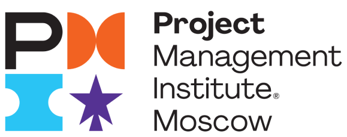

<div align="center">
  <br>
  
  <h1>PMI Moscow club</h1>
</div>

## TESTS
[](https://github.com/TopTuK/pmi.moscow.club/actions/workflows/tests.yml)
[](https://github.com/TopTuK/pmi.moscow.club/actions/workflows/check_build_and_run.yml)

## RU
Привет! Этот проект содержит исходники [PMI Russia](https://pmi.moscow) клуба. Мы строим наше комьюнити экпертов в управлении проектами вокруг института [PMI](https://pmi.org). В 2022 году равление PMI приняло решение о приостановке детяльности локальных отделений PMI в России, Беларуси, ДНР и ЛНР, поэтому нами было принято решение о создании временно независимого сообщества экпертов, главнами ценностями которого являются люди, их знания, навыки и опыт.

Проект строится на кодовой базе [vas3k.club](https://vas3k.club), является форком [кодовой базы](https://github.com/vas3k/vas3k.club). Проект открыт к измениям, мы приветствуем новых участников и контрибьютеров.

Членство в клубе является приватным и строится членами института управления проектами PMI. Мы строим мирное и полезное сообщество. где каждый участник может найти для себя различную полезную информацию об управлении проектами, создании новых уникальных продуктов, услуг или конечных результатов.

## EN
TBD: перевести.

## 🛠 Технический стек
👨‍💻 **TL;DR: Django, Postgres, Redis, Vue.js, Webpack**
Оригинальная информация доступна тут: [vas3k.club](https://github.com/vas3k/vas3k.club)

## 🧑‍💻 Хочу покодить

### 🔮 Простой способ запуска платформы клуба

1. Установить [Docker](https://www.docker.com/get-started)
2. Клонировать репозитарий

  ```sh
  $ git clone https://github.com/TopTuK/pmi.moscow.club.git
  $ cd pmi.moscow.club
  ```

3. Создать и отредактировать .env файл

  ```sh
  $ cd club
  $ cp .env.example .env
  ```
  Ключевые параметры:
  ```
  POSTGRES_USER="postgres"
  POSTGRES_PASSWORD="postgres"

  MEDIA_UPLOAD_URL="pepic_url"
  MEDIA_UPLOAD_CODE="pepic_code"

  EMAIL_HOST="mail_host"
  EMAIL_HOST_USER="mail_sender_user"
  EMAIL_HOST_PASSWORD="mail_sender_user_password"
  ```

4. Запустить сервисы

  ```sh
  $ docker-compose up
  ```

### 🔮 Простой способ запуска платформы клуба
Для локальной разработки, тестирования телеграм ботов, запуск платформы без Docker инструкция здесь: [docs/setup.md](docs/setup.md).

## 👩‍💼 Лицензия (License)

[MIT](LICENSE)

❤️ Meow! ❤️
