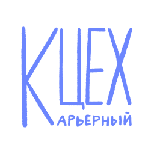

<div align="center">
  <br>
  
  <h1>vas3k.club</h1>
</div>

Welcome to the [vas3k.club](https://vas3k.club) codebase. We're building our own little IT-lifestyle community. We've opensourced the code so that every member could contribute or implement a feature that they want.

[vas3k.club](https://vas3k.club) is a platform with private and paid memberships that has emerged around the [vas3k.blog](https://vas3k.blog) blog and satellite chat rooms. It's not a typical IT community with tutorials and framework reviews, but rather more of a lifestyle one. We are trying to build a peaceful and useful ecosystem, which the Internet has lost a long ago. Therefore, we carefully select and filter new members and do not seek wild growth.

Our values: honesty, fair share, respect for other members, rationality, friendliness and usefulness. We have a zero-tolerance policy on anonymity, insults and toxicity. But we always try to stay in touch with reality, so we're also not tolerant of witch hunting and call-out culture.

We're a bullshitless community!

## 🛠 Tech stack

👨‍💻 **TL;DR: Django, Postgres, Redis, Vue.js, Webpack**

We try to keep our stack as simple and stupid as possible. Because we're not very smart either.

The trickiest part of our stack is how we develop the frontend and backend as a single service. We don't use SPA, as many people do, but only make parts of the page dynamic by inserting Vue.js components directly into Django templates. This may seem weird, but it actually makes it very easy for one person to develop and maintain the entire site.

You don't really need to understand how the magic of webpack <-> django communication works under the hood to develop new components. Just run `django runserver` and `npm run watch` at the same time and enjoy your coding.

Feel free to propose "state of the art" refactorings for UI or backend code if you know how to do it better. We're open for best practices from both worlds.

## 🔮 Installing and running locally

1. Install [Docker](https://www.docker.com/get-started)

2. Clone the repo

    ```sh
    $ git clone https://github.com/vas3k/vas3k.club.git
    $ cd vas3k.club
    ```

3. Run

    ```sh
    $ docker compose up
    ```

This will start the application in development mode on [http://127.0.0.1:8000/](http://127.0.0.1:8000/), as well as other necessary services: postgres database, queue with workers, redis and webpack. 

The first time you start it up, you'll probably need a test account to get right in. Go to [/godmode/dev_login/](http://127.0.0.1:8000/godmode/dev_login/) and it will create an admin account for you (and log you in automatically). To create new test user hit the [/godmode/random_login/](http://127.0.0.1:8000/godmode/random_login/) endpoint.

Auto-reloading for backend and frontend is performed automatically on every code change. If everything is broken and not working (it happens), you can always rebuild the world from scratch using `docker compose up --build`.

## 🧑‍💻 Advanced setup for devs

For more information on how to test the telegram bot, run project without docker and other useful notes, read [docs/setup.md](docs/setup.md).

## ☄️ Testing

We use standard Django testing framework for backend and Jest for frontend. No magic, really.

See [docs/test.md](docs/test.md) for more insights.

## 🚢 Deployment

No k8s, no AWS, we ship dockers directly via ssh and it's beautiful!

The entire production configuration is described in the [docker-compose.production.yml](docker-compose.production.yml) file. 

Then, [Github Actions](.github/workflows/deploy.yml) have to take all the dirty work. They build, test and deploy changes to production on every merge to master (only official maintainers can do it).

Explore the whole [.github](.github) folder for more insights.

We're open for proposals on how to improve our deployments without overcomplicating it with modern devops bullshit.

## 🛤 Forking and tweaking

Forks are welcome. We're small and our engine is not universal like Wordpress, but with sufficient programming skills (and using grep), you can launch your own Club website in a couple of weeks. 

Three huge requests for everyone:

- Please give kudos the original authors. "Works on vas3k.club engine" in the footer of your site will be enough.
- Please share new features you implement with us, so other folks can also benefit from them, and your own codebase minimally diverges from the original one (so you can sync updates and security fixes) . Use our [feature-flags](club/features.py).
- Do not use our "issues" and chats as a support desk for your own fork.

> ♥️ [Feature-flags](club/features.py) are great. Use them to tweak your fork. Create new flags to upstream your new features or disable existing ones.

## 🙋‍♂️ How to report a bug or propose a feature?

- 🆕Open [a new issue](https://github.com/vas3k/vas3k.club/issues/new) using one of the existing templates. 
- 🔦 Please, **use the search function** to make sure you aren't creating a duplicate.
- 🖼 Provide ALL the details, screenshots, logs, etc. Bug reports without steps to reproduce will be closed.

## 😍 Contributions

Important information for everyone willing to contribute to this project.

- AI-generated PRs are NOT welcome.
- Low-effort PRs are NOT welcome.
- No cowboy PRs without prior discussion AND approval from maintainers.
- 1 PR = 1 feature. No PRs with bulk changes.
- Any PR longer than 10 lines of code must include a detailed text explanation of all changes.

**A good way to contribute bug fixes:** search the Issues to make sure the bug hasn't been reported yet. Open a new Issue with a detailed description and steps to reproduce. Open a PR with the fix (if you can), then the contributors will either merge your PR or you'll carry on the discussion in the comments.

**For new features:** open a new Issue describing the new feature you're interested in. Wait for the contributors to get back to you and give you the green light for implementation. If the contributors don't reply, it means the feature isn't of interest at the moment. ONLY after that should you open a PR for that feature.

The main point of interaction is the [Issues page](https://github.com/vas3k/vas3k.club/issues) and our Dev-chat (@vas3k_club_dev in telegram). DO NOT DISCUSS FORKS THERE.

If you want to contribute but don't know where to start — come to the chat and just ask! 

> The official development language at the moment is Russian, because 100% of our users speak it. We don't want to introduce unnecessary barriers for them. But we are used to writing commits and comments in English and we won't mind communicating with you in it.

## 🔐 Security and vulnerabilities

If you think you've found a critical vulnerability that should not be exposed to the public yet, you can always email me directly on Telegram [@vas3k](https://t.me/vas3k) or by email: [me@vas3k.ru](mailto:me@vas3k.ru).

Please do not test vulnerabilities in public. If you start spamming the website with "test-test-test" posts or comments, our moderators will ban you even if you had good intentions.

## 👩‍💼 License 

[MIT](LICENSE)

You can use the code for your own private or commercial purposes with an author attribution (by including the original license file and mentioning vas3k.club somewhere on your website 🎩).

Feel free to contact us via email [club@vas3k.club](mailto:club@vas3k.club).

❤️
