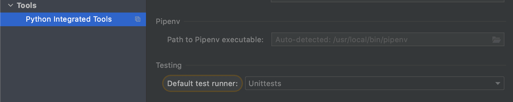
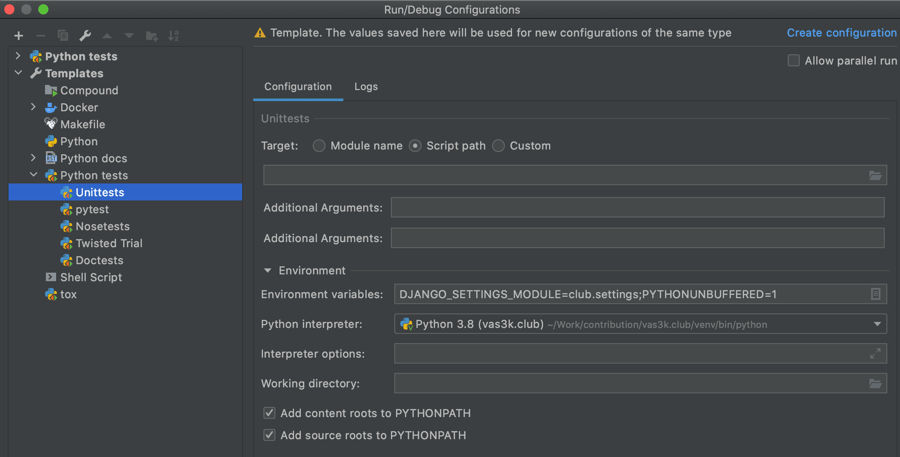

# Testing

## Prerequisites

Consider next required conditions for running tests:

- **pipenv**

  Don't forget to run it under configured pipenv. Install dependencies with `pipenv install --dev`
- **postgres**

  Due to tests make database queries the local postgres should be running.

  Run postgres:
  ```sh
  $ docker compose -f docker-compose.yml up -d postgres
  ```
  For first time run migrations (it needs only for fresh images)
  ```sh
  $ pipenv run python3 manage.py migrate
  ```
- **redis**
  Run redis:
  ```sh
  $ docker compose -f docker-compose.yml up -d redis
  ```
- build **frontend**

  For [views tests](https://docs.djangoproject.com/en/5.1/intro/tutorial05/#a-test-for-a-view) its essential to build our frontend upfront.
  Hot to build front look [setup-frontend](#setup-frontend) section, for now just run next commands:
  ```sh
  $ cd frontend
  $ npm ci # or npm install
  $ npm run build
  ```
  Above commands will create [required `webpack-stats.json`](https://github.com/vas3k/vas3k.club/blob/6f1812f36b546feba2bd729ac84011e20e237136/club/settings.py#L228) file
- test environment variables (needed when running `manage.py test` directly, `make test` sets them automatically)
  ```dotenv
  TESTS_RUN=true
  POSTGRES_DB=vas3k_club
  POSTGRES_USER=postgres
  POSTGRES_PASSWORD=postgres
  POSTGRES_HOST=localhost
  REDIS_DB=0
  REDIS_HOST=localhost
  ```

## Run tests

Basically tests automatically runs in CI in opened PR, but if you want to run tests **locally** there are few ways to do it
1. make (recommended)
   ```sh
   $ make test
   ```
2. pipenv shell
   ```sh
   $ TESTS_RUN=true pipenv run python3 manage.py test
   ```
3. pycharm *profession edition*
   Use `django tests` template out of the box. Add `TESTS_RUN=true` to environment variables.
4. pycharm *common edition*
   - Make sure you have set `Unittest` as default test runner: Settings --> Tools --> Python Integrated Tools --> Default Test Runner: Unittests
   
   - In Run/Debug Configuration put environment variables from [prerequisites](#Prerequisites)
     
   - For workaround *"django.core.exceptions.AppRegistryNotReady: Apps aren't loaded yet."* add this lines to test file before importing models:
     ```python
     import django
     django.setup()
     ```

For more information about testing in django look well written [official documentation](https://docs.djangoproject.com/en/5.1/topics/testing/overview/)

## Frontend tests

Frontend tests use [Jest](https://jestjs.io/) with jsdom and cover utility functions and DOM-related logic (`stylizeExternalLinks`, etc.).

### Prerequisites

- Node.js 22+
- Dependencies installed: `cd frontend && npm ci`

No postgres, redis or python required.

### Run frontend tests

```sh
# via make
$ make test-frontend

# or directly
$ cd frontend
$ npm test
```

Frontend tests also run automatically in CI as a separate `frontend-test` job.
